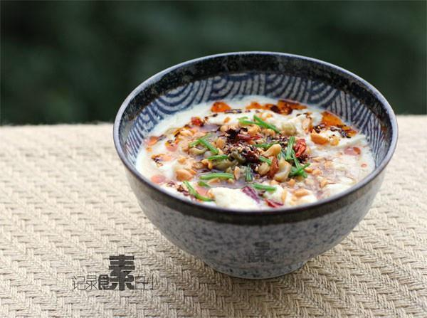

# 自制豆腐脑

## 📋 基本資訊 / Recipe Overview
- **料理名稱**：自制豆腐脑
- **原始標題**：自制豆腐脑
- **素食流派 / Diet**：全素 Vegan
- **料理分類 / Category**：家常蔬食 / 经典热菜
- **來源平台 / Source**：[下廚房 · 素食主義專區](https://www.xiachufang.com/recipe/1003732/)

## 🌿 食材及佐料清單 / Ingredients
- 500g豆浆
- 1.25g(1小匙）内酯
- 1大匙麻辣花生
- 少许香芹碎
- 1大匙榨菜
- 1大匙醋
- 1大匙生抽
- 1小匙辣椒油

## 🍳 烹飪步驟 / Step-by-Step Cooking Steps
1. 内酯1.25g(约1小匙）放入碗中，加1大匙温水化开
2. 将刚煮好后晾凉2分钟的豆浆（90度到80度之间）倒入化好内酯的碗中，不需要搅拌
3. 盖上盖子，静置10-20分钟即成豆花
4. 加上切碎的麻辣花生和榨菜，倒入1大匙醋1大匙生抽，浇1小匙辣椒油，少许香芹碎即可

## 💡 大廚美味秘訣 / Chef's Tips
- 1.自己在家煮豆浆最好稍微浓稠些，这样做出的豆花也更香 
2.豆浆盖上盖子静置的时间长短跟温度有关，如果是冬天就需要20分钟，夏天就短些 
3.北方大多是咸口的，南方很多都吃甜口的，根据喜好调整 
4.豆浆过滤好后一下子冲入调了内酯的碗中，切忌直接过滤到调了内酯的碗中，这样豆花会做不成

---
*食譜歸檔時間：2026-08-20 · 來源：下廚房 (www.xiachufang.com)*