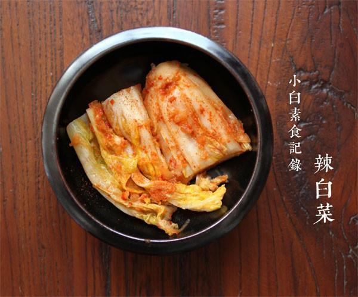

# 自己腌辣白菜

## 📋 基本資訊 / Recipe Overview
- **料理名稱**：自己腌辣白菜
- **原始標題**：自己腌辣白菜
- **素食流派 / Diet**：全素 Vegan
- **料理分類 / Category**：面食主食
- **來源平台 / Source**：[下廚房 · 素食主義專區](https://www.xiachufang.com/recipe/1011972/)

## 🌿 食材及佐料清單 / Ingredients
- 一颗大白菜
- 半个梨
- 半个苹果
- 一块姜
- 适量盐
- 1大匙糖
- 2大匙辣椒粉
- 1大匙糯米粉
- 6大匙冷水
- 半根白萝卜

## 🍳 烹飪步驟 / Step-by-Step Cooking Steps
1. 大白菜竖着切成四瓣，每层叶子都均匀抹上盐，放置一夜，让白菜出水， 此时白菜只有腌之前的一半量了，用水清洗掉白菜上的盐分，尝一下味道，如果太咸就用水多泡一会，接着用手挤干白菜的水分，待用
2. 把生姜切碎，苹果和梨去掉皮，用擦丝器擦成泥，或者用搅拌机打碎。 白萝卜去皮擦成细丝，用手挤掉水分待用
3. 1大匙糯米粉与6大匙冷水搅拌均匀，小火加热成糊，趁热加入辣椒粉拌匀成酱，待辣椒酱冷却至常温，与苹果梨泥、姜末、萝卜丝、糖拌匀
4. 将混合物涂抹在处理好的白菜上，每一片都要抹上。将白菜摆在密封盒里，压实， 放置常温发酵两三天即可食用，一周以上风味更加

## 💡 大廚美味秘訣 / Chef's Tips
- 1.如果腌两颗白菜，以上调料分量加倍~ 
2.如果洗完盐腌过的白菜，咸味不够就需要在辣椒酱里多放点盐，如果正好就不需要 
3.辣椒粉的量也根据个人口味增减 
4.冬天腌辣白菜，一定要放室内发酵哦，阳台太冷了，发酵需要一定的温度常温发酵几天或一周，之后移冰箱冷藏 
5.对于密封性好的容器，发酵所产生的气体会让塑料的密封盒鼓起来，可以适当打开放一下气 
 
另外方法有很多种，也有往里面加胡萝卜丝的，或者不用自己煮糯米糊辣椒酱，直接抹上韩式辣酱的~根据个人情况灵活变化

---
*食譜歸檔時間：2026-08-20 · 來源：下廚房 (www.xiachufang.com)*