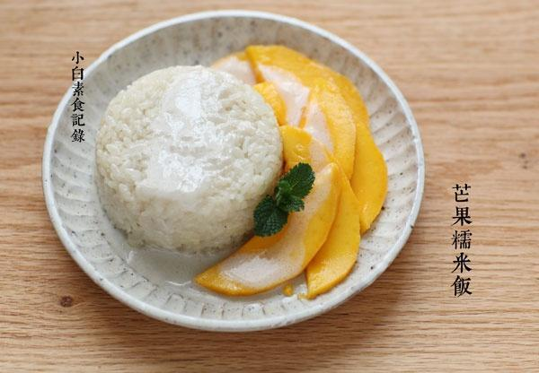

# 芒果糯米饭

## 📋 基本資訊 / Recipe Overview
- **料理名稱**：芒果糯米饭
- **原始標題**：芒果糯米饭
- **素食流派 / Diet**：全素 Vegan
- **料理分類 / Category**：米食主食
- **來源平台 / Source**：[下廚房 · 素食主義專區](https://www.xiachufang.com/recipe/1092911/)

## 🌿 食材及佐料清單 / Ingredients
- 150G糯米
- 170m+30ml减脂椰浆
- 1大匙（15ml)糖
- 1/2小匙(2.5ml)盐
- 芒果一个

## 🍳 烹飪步驟 / Step-by-Step Cooking Steps
1. 首先把糯米泡一夜。讲究点可以买泰国糯米，其实用本地食材做更方便，如果你愿意也可以用2/3的糯米加上1/3的泰国香米。两种方法我都试过，差异不大的。总共200ml椰浆放入锅中加糖和盐加热至糖融化。然后取170ml的椰浆倒入泡好的糯米中，用椰浆来煮糯米饭，跟煮大米饭一样，放电饭锅里就行了。煮好后用饭勺拌松，装盘之前将糯米饭盛入碗中，然后倒扣在盘子里。
2. 大芒果去皮，切下果肉，然后再将其切片~待用
3. 装盘，将糯米饭盛入碗中，倒扣在盘子里，然后摆上切好的芒果，把剩余的椰浆淋在上面即可~

## 💡 大廚美味秘訣 / Chef's Tips
- 前阵子聚会，跟小爆和肉星讨论过正宗椰浆饭上面的脆脆的东西的问题，确实很提味，但是量少不好操作，且淘宝没找到，就是去了皮的绿豆仁烤或炸熟的，于是小月买了去皮绿豆仁给我，烤的也试过了，炸的也试过了~不太好操作。。。所以就不建议大家添加了

---
*食譜歸檔時間：2026-08-20 · 來源：下廚房 (www.xiachufang.com)*