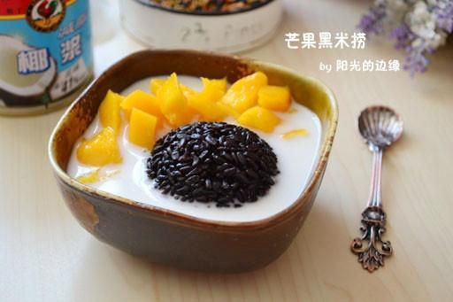

# 芒果黑米捞

## 📋 基本資訊 / Recipe Overview
- **料理名稱**：芒果黑米捞
- **原始標題**：芒果黑米捞
- **素食流派 / Diet**：全素 Vegan
- **料理分類 / Category**：家常蔬食 / 经典热菜
- **來源平台 / Source**：[下廚房 · 素食主義專區](https://www.xiachufang.com/recipe/266895/)

## 🌿 食材及佐料清單 / Ingredients
- 1杯黑米
- 半个芒果
- 1.5杯水
- 半罐椰浆
- 2块方糖

## 🍳 烹飪步驟 / Step-by-Step Cooking Steps
1. 黑米洗净，加水浸泡4小时或以上
2. 把泡好的黑米放入电饭煲内，加入泡米的水
3. 按下煮饭键
4. 煮饭开关跳起后用饭勺搅匀
5. 取一个半圆形容器，冲一下水防粘，放入黑米压实
6. 口入碗内
7. 芒果洗净
8. 对半切后去核去皮，切小块
9. 小锅内倒入椰浆
10. 根据喜好放入砂糖
11. 加热至糖融化，不必煮开，倒入小碗内
12. 旁边放上芒果丁即可

## 💡 大廚美味秘訣 / Chef's Tips
- 1、我用的是迷你电饭锅，所以一杯米就可以煮了，锅子大的要多放米。 
2、椰浆是这道甜品的关键，一定要买好的。 
3、椰浆不用煮开，只需要加热至糖融化。

---
*食譜歸檔時間：2026-08-20 · 來源：下廚房 (www.xiachufang.com)*