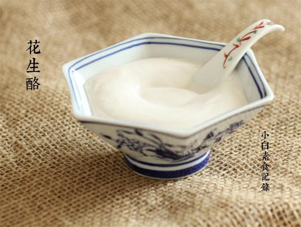

# 花生酪

## 📋 基本資訊 / Recipe Overview
- **料理名稱**：花生酪
- **原始標題**：花生酪
- **素食流派 / Diet**：全素 Vegan
- **料理分類 / Category**：家常蔬食 / 经典热菜
- **來源平台 / Source**：[下廚房 · 素食主義專區](https://www.xiachufang.com/recipe/1042597/)

## 🌿 食材及佐料清單 / Ingredients
- 50g生的带红皮花生
- 20g生糯米
- 250ml水
- 1大匙糖

## 🍳 烹飪步驟 / Step-by-Step Cooking Steps
1. 先将生的带皮花生和糯米一起浸泡3小时以上泡软
2. 将泡好的花生和糯米放入搅拌机中加250ml水打成浆
3. 用筛网将浆中的渣滓过滤出来
4. 过滤好的浆加入糖，放入小锅中，小火加热，一定要一边加热一边搅拌，否则糯米成分会结块，回越来越稠，一直加热到冒泡即可关火

## 💡 大廚美味秘訣 / Chef's Tips
- 1.花生我用的是干的带皮花生，也可以用新鲜的~ 
2.糯米的加入是为了让酪浓稠，在煮的过程中会越来越稠 
 3.禁止用有加热功能的豆浆机来做，会结块无法过滤 
4.过滤出来的渣，我称了一下是110g，加了8g油，10g面粉和一点盐拌匀，拍成3厘米直接的小薄饼，放平底锅小火烙至两面金黄~还不错 
 
有的童鞋说会有点花生的土腥味~带皮是会有点的，可以泡透去皮这样就没异味了~就是损失了一部分营养，各有利弊啦

---
*食譜歸檔時間：2026-08-20 · 來源：下廚房 (www.xiachufang.com)*