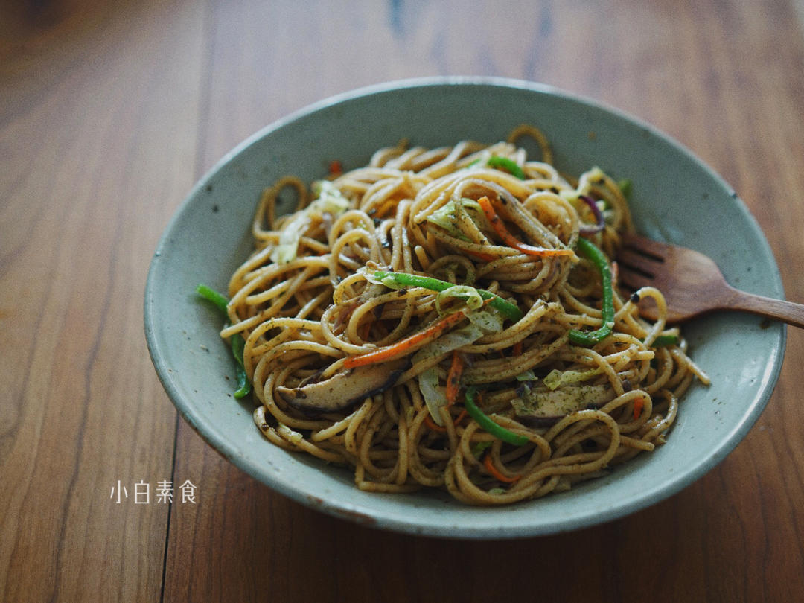

# 花生酱海苔意面

## 📋 基本資訊 / Recipe Overview
- **料理名稱**：花生酱海苔意面
- **原始標題**：花生酱海苔意面
- **素食流派 / Diet**：全素 Vegan
- **料理分類 / Category**：面食主食
- **來源平台 / Source**：[下廚房 · 素食主義專區](https://www.xiachufang.com/recipe/102129747/)

## 🌿 食材及佐料清單 / Ingredients
- 一人份（100G左右干面）意面
- 1/4颗到1/8颗（视大小）圆白菜
- 两三朵香菇
- 一小节胡萝卜
- 半个或1/3个青椒
- 少许紫洋葱
- 以下是酱料部分
- 15g纯花生酱
- 20g酱油
- 1g糖
- 15g水
- 1/3张寿司海苔

## 🍳 烹飪步驟 / Step-by-Step Cooking Steps
1. 我这次选用的全麦意面，所以颜色比较深
2. 图中是100%花生酱，做法很简单，生花生粒用烤箱烤熟，双手搓掉红皮，用料理机打碎即可（估计对机器功率有点要求）然后装瓶，冷藏储存。我做的这种花生酱什么都不放，不放油，因为花生本身有很多脂肪了，也不放糖和盐。
3. 香菇切片、胡萝卜青酱切丝，洋葱切片，圆白菜切丝待用。（看到我的食谱中出现洋葱请不要奇怪，毕竟，它是蔬菜）
4. 煮面：烧开一锅水，放入意面按照包装说明的时间来煮就可以。厨房准备一个定时器非常方便，煮好捞出控干水分，然后加少许油拌匀防止粘住。
5. 面刚煮上的时候调酱汁，把花生酱、酱油、水、糖称入碗中，然后把1/3张海苔裁成小片叠在一起，用剪刀先剪成丝，再剪成碎，混合均匀。（不同品牌酱油咸度不一样，千万别用老抽或红烧酱油。。。）
6. 炒锅烧热，加少许油，先放胡萝卜香菇洋葱青椒炒熟，再加入圆白菜稍微翻炒，倒入意面和调好的酱汁炒匀，这个时候品尝一样，根据自己口味酌情添加糖和盐。出锅
7. 装盘后撒少许青海苔粉，如果手头有熟花生也可以碾碎撒一些增加口感。

## 💡 大廚美味秘訣 / Chef's Tips
- 这是 HaveFun!有饭 在去年供应过的季节性餐品，我想，以后有机会把有饭的食谱慢慢分享给大家，其实并没有什么秘密，有心人细细品尝一下都可以复制出餐厅的食谱，不能复制的可能就是那份用心。比如，因为市售花生酱多有添加，所以选择自制，做花生酱也并没有什么难处，选择优质饱满花生，入烤箱烘熟，搓掉外皮，放入机器中磨成酱就可以，花生酱的原料就是100%的花生，别的什么都没有。自己在家做花生酱也简单，用比较给力的料理机就可以~。
这一道的酱汁里有香浓的花生酱，适量加入增加酱汁稠度又不会太腻，还有东方人口味的酱油，选了各色秋季时蔬，添加了有点日式的元素：海苔。
以下是一人份用量

---
*食譜歸檔時間：2026-08-20 · 來源：下廚房 (www.xiachufang.com)*