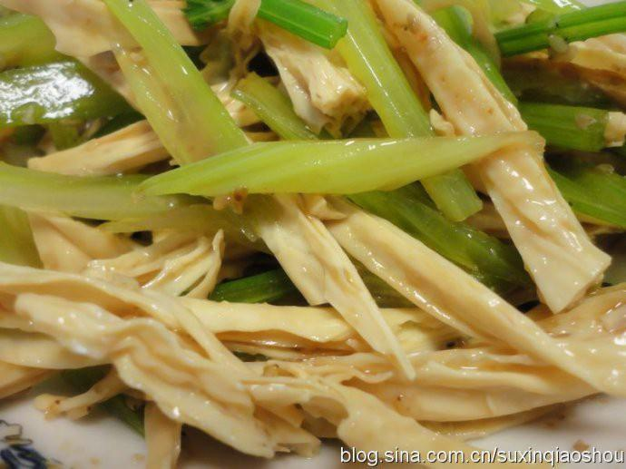

# 芹菜拌腐竹

## 📋 基本資訊 / Recipe Overview
- **料理名稱**：芹菜拌腐竹
- **原始標題**：芹菜拌腐竹
- **素食流派 / Diet**：全素 Vegan
- **料理分類 / Category**：家常蔬食 / 经典热菜
- **來源平台 / Source**：[下廚房 · 素食主義專區](https://www.xiachufang.com/recipe/95451/)

## 🌿 食材及佐料清單 / Ingredients
- 1根腐竹
- 2根芹菜
- 麻油
- 盐
- 生抽
- 醋
- 熟芝麻

## 🍳 烹飪步驟 / Step-by-Step Cooking Steps
1. 腐竹泡发，切丝
2. 芹菜摘叶洗净，热火中焯一下立即放入冷水中（这样可以让绿色菜更鲜艳），沥干水份
3. 先撒盐拌匀，再依个人口味加生抽、醋，最后撒点熟的芝麻（最好破皮，更易吸收）

## 💡 大廚美味秘訣 / Chef's Tips
- 1、芹菜叶不要随意丢哦，平常我最常做的是蒸芹菜叶 
2、其实芹菜根可以熬素高汤，我还没有试做成功，等成功后再发上来跟大家分享

---
*食譜歸檔時間：2026-08-20 · 來源：下廚房 (www.xiachufang.com)*