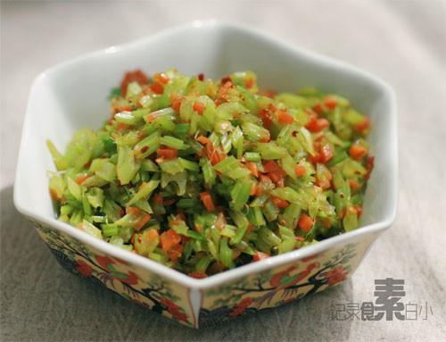

# 芹菜胡萝卜碎

## 📋 基本資訊 / Recipe Overview
- **料理名稱**：芹菜胡萝卜碎
- **原始標題**：芹菜胡萝卜碎
- **素食流派 / Diet**：全素 Vegan
- **料理分類 / Category**：家常蔬食 / 经典热菜
- **來源平台 / Source**：[下廚房 · 素食主義專區](https://www.xiachufang.com/recipe/1000613/)

## 🌿 食材及佐料清單 / Ingredients
- 芹菜
- 胡萝卜
- 盐
- 生抽

## 🍳 烹飪步驟 / Step-by-Step Cooking Steps
1. 芹菜洗净，摘掉叶子（待用），切成丁，胡萝卜切碎
2. 锅烧热倒少许油，下胡萝卜碎炒香，加盐和生抽调味，最后加芹菜丁翻炒一分钟即可

## 💡 大廚美味秘訣 / Chef's Tips
- 夏天来了~多吃点高纤维的~

---
*食譜歸檔時間：2026-08-20 · 來源：下廚房 (www.xiachufang.com)*