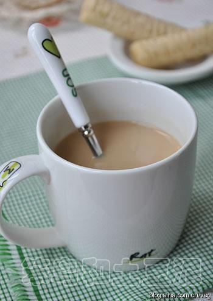

# 英式奶茶

## 📋 基本資訊 / Recipe Overview
- **料理名稱**：英式奶茶
- **原始標題**：英式奶茶
- **素食流派 / Diet**：奶素 Lacto-Vegetarian
- **料理分類 / Category**：家常蔬食 / 经典热菜
- **來源平台 / Source**：[下廚房 · 素食主義專區](https://www.xiachufang.com/recipe/15010/)

## 🌿 食材及佐料清單 / Ingredients
- （阿萨姆）红茶
- 牛奶
- 砂糖

## 🍳 烹飪步驟 / Step-by-Step Cooking Steps
1. 先用开水将茶杯温热，再倒掉。目的是避免茶杯过冷而使水温降低，影响红茶的冲泡
2. 重新注入开水，水量至茶杯的二分之一处
3. 放入茶包，注意不要用勺子挤压茶包，以免产生苦涩味
4. 迅速盖上茶碟，焖泡1-2分钟
5. 时间到，去掉茶碟，来回晃动茶包数次，使茶汤颜色均匀。取出茶包，倒入牛奶至茶杯的三分之二处，喜欢甜味的可加入白砂糖，用茶勺搅拌均匀即可饮用。可搭配酥脆的饼干、松饼等茶点一起食用

## 💡 大廚美味秘訣 / Chef's Tips
- 1.茶水和牛奶的比例为2:1，也可根据自己的喜好调整。 
2.牛奶使用常温即可，不必加热。

---
*食譜歸檔時間：2026-08-20 · 來源：下廚房 (www.xiachufang.com)*