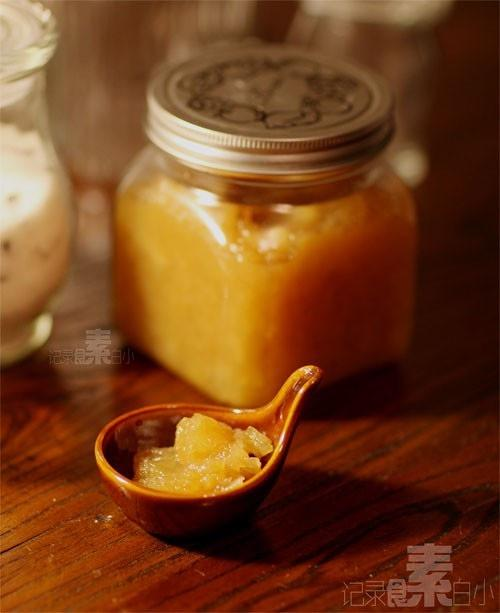

# 苹果酱

## 📋 基本資訊 / Recipe Overview
- **料理名稱**：苹果酱
- **原始標題**：苹果酱
- **素食流派 / Diet**：全素 Vegan
- **料理分類 / Category**：家常蔬食 / 经典热菜
- **來源平台 / Source**：[下廚房 · 素食主義專區](https://www.xiachufang.com/recipe/1001654/)

## 🌿 食材及佐料清單 / Ingredients
- 苹果
- 冰糖
- 柠檬汁

## 🍳 烹飪步驟 / Step-by-Step Cooking Steps
1. 苹果去皮切成小丁，苹果量三分之一的水，和苹果量六分之一的冰糖， 一起放入锅中小火炖一个半小时
2. 中途变的稍稍粘稠时需要勤搅拌，苹果软烂时用勺子压烂一半的果肉
3. 最后临出锅时加少许柠檬汁调味

## 💡 大廚美味秘訣 / Chef's Tips
- 果酱的做法也是有很多种，今天是用的最简单的做法 
虽然只加了果肉重量六分之一的糖还是觉得太甜。。。但是糖量确实不能再少了 
 一般都会加果肉三分之一或二分之一的糖，因为我家苹果实在太甜了，建议用酸味重的苹果熬酱 
最后为了增加点酸味不得不加了一勺柠檬汁 
这次想保留果粒的口感所以没用搅拌机，如果喜欢细致的口感可在苹果煮软后用搅拌机打碎 
再倒入锅中煮至粘稠

---
*食譜歸檔時間：2026-08-20 · 來源：下廚房 (www.xiachufang.com)*