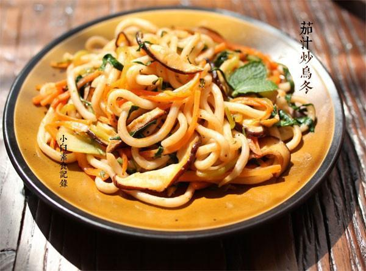

# 茄汁炒乌冬面

## 📋 基本資訊 / Recipe Overview
- **料理名稱**：茄汁炒乌冬面
- **原始標題**：茄汁炒乌冬面
- **素食流派 / Diet**：全素 Vegan
- **料理分類 / Category**：面食主食
- **來源平台 / Source**：[下廚房 · 素食主義專區](https://www.xiachufang.com/recipe/1039839/)

## 🌿 食材及佐料清單 / Ingredients
- 一包乌冬面
- 三两朵新鲜香菇
- 三两棵小油菜
- 一段胡萝卜
- 2大匙番茄酱
- 1小匙糖
- 1/2小匙盐
- 3大匙水
- 一点点黑胡椒粉

## 🍳 烹飪步驟 / Step-by-Step Cooking Steps
1. 香菇洗净去蒂，小油菜洗净，胡萝卜去皮
2. 香菇、胡萝卜切丝，小油菜把梗和叶分别切丝
3. 烧开一锅水，下入乌冬稍微一下，用筷子搅拌煮散即可捞出控水，不要煮久以免影响口感
4. 将调料中的番茄酱、水、盐、糖混合均匀待用
5. 炒锅烧热下油，下胡萝卜丝和香菇丝超软，然后下煮过的乌冬和切丝的小油菜梗同炒
6. 倒入刚才调好的调味汁和切丝的小油菜叶炒匀即可关火

## 💡 大廚美味秘訣 / Chef's Tips
- 我用的是真空包装的乌冬面，一般超市冷藏区都能找到。 
将小油菜叶和梗分开是因为，炒熟需要的时间不一样，最后放叶颜色更翠绿好看些

---
*食譜歸檔時間：2026-08-20 · 來源：下廚房 (www.xiachufang.com)*