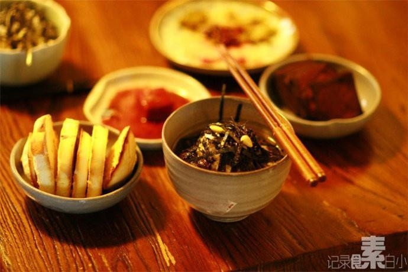

# 茶泡饭

## 📋 基本資訊 / Recipe Overview
- **料理名稱**：茶泡饭
- **原始標題**：茶泡饭
- **素食流派 / Diet**：全素 Vegan
- **料理分類 / Category**：米食主食
- **來源平台 / Source**：[下廚房 · 素食主義專區](https://www.xiachufang.com/recipe/36106/)

## 🌿 食材及佐料清單 / Ingredients
- 剩米饭
- 绿茶
- 芝麻
- 海苔

## 🍳 烹飪步驟 / Step-by-Step Cooking Steps
1. 将茶叶煮的滚开，滤掉茶叶，然后倒入米饭中，快要没过米饭即可，上面撒点海苔丝，熟芝麻
2. 我今天还放了几颗松子，少许盐，和芥末

## 💡 大廚美味秘訣 / Chef's Tips
- 这个茶泡饭一定要热热的吃，才有味，再配点小菜，恩，足矣！ 
再小小啰嗦下，关于泡饭对胃不好的传说，主要原因是，吃泡饭时往往不去细嚼，而是连汤带饭囫囵吞下，我们的胃要求消化整粒的米自然费劲切，长期这样，确实对胃不好，所以，吃泡饭的时候，一定要细嚼慢咽，就不会对胃产生伤害。不单单泡饭，吃什么都要细嚼慢咽才是养生之道。

---
*食譜歸檔時間：2026-08-20 · 來源：下廚房 (www.xiachufang.com)*