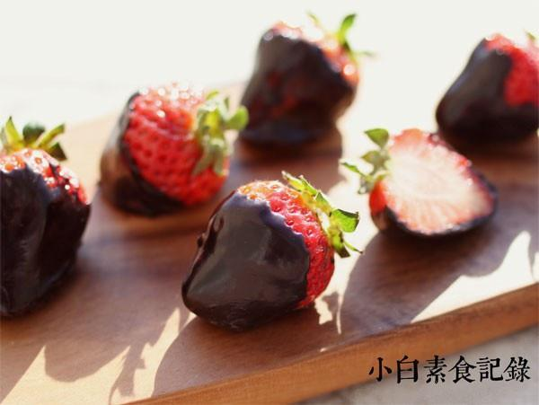

# 草莓伯爵

## 📋 基本資訊 / Recipe Overview
- **料理名稱**：草莓伯爵
- **原始標題**：草莓伯爵
- **素食流派 / Diet**：全素 Vegan
- **料理分類 / Category**：家常蔬食 / 经典热菜
- **來源平台 / Source**：[下廚房 · 素食主義專區](https://www.xiachufang.com/recipe/1025967/)

## 🌿 食材及佐料清單 / Ingredients
- 12个草莓
- 70g黑巧克力

## 🍳 烹飪步驟 / Step-by-Step Cooking Steps
1. 草莓洗净，用纸巾擦干表面的水分。黑巧掰开
2. 掰碎的黑巧放入小锅中，坐入烧开了水的大锅中，隔水加热，边加热边搅拌至巧克力完全融化
3. 取一个草莓在融化的巧克力中蘸一下，让巧克力液均匀裹在草莓上，草莓的3/4裹上巧克力即可，这样比较好看。将裹好巧克力的草莓摆在涂了油的平盘上，稍晾凉后移冰箱冷藏一会~，加速巧克力凝固，吃起来外皮脆脆的
4. 做好后冷藏保存，尽量在两天内食用

## 💡 大廚美味秘訣 / Chef's Tips
- 很简单的不用烤箱的甜品~外皮脆脆的微苦的黑巧克力，里面甜软多汁的草莓~

---
*食譜歸檔時間：2026-08-20 · 來源：下廚房 (www.xiachufang.com)*