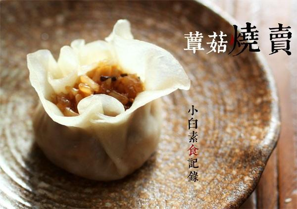

# 菌菇烧卖

## 📋 基本資訊 / Recipe Overview
- **料理名稱**：菌菇烧卖
- **原始標題**：菌菇烧卖
- **素食流派 / Diet**：全素 Vegan
- **料理分類 / Category**：面食主食
- **來源平台 / Source**：[下廚房 · 素食主義專區](https://www.xiachufang.com/recipe/1039255/)

## 🌿 食材及佐料清單 / Ingredients
- 120g普通面粉
- 30g澄面（小麦淀粉）
- 10g油
- 90g热开水
- 半碗糯米
- 三四朵香菇
- 几朵平菇
- 一个杏鲍菇
- 一小把木耳
- 1小匙老抽
- 1小匙盐
- 1小匙糖

## 🍳 烹飪步驟 / Step-by-Step Cooking Steps
1. 糯米用水浸泡一夜，捞出沥干水分，放容器中干蒸30分钟待用
2. 各种菇洗净切碎，一小块生姜也切末与菇拌匀，加入老抽、糖、盐和一大匙油拌匀
3. 锅烧热下入拌好的馅料炒香，加入30ml的水，然后下蒸好的糯米一起炒，可根据情况适当加水，不要太湿，糯米保持一粒一粒的最好
4. 面粉澄粉拌匀（也可只用面粉，加入一点澄面面的延展性透明性会更好）缓缓加入热开水一边快速搅拌，稍晾凉然后将面揉成团，再加入油继续揉成光滑面团
5. 将面团搓成长条，切成30等分，每份都揉圆，压扁，然后像擀饺子皮一样擀，注意最后着重擀下边缘，这样就有烧卖的荷叶边了
6. 填入炒好的馅料，上面用虎口微收口即可。上烧开水的蒸锅，大火蒸8--10分钟即可

## 💡 大廚美味秘訣 / Chef's Tips
- 1.糯米浸泡后一定要干蒸，不要带水蒸，这点很重要，后来再炒的过程中它会吸到调过味的汤汁，油亮亮的~ 
2.和面可只用面粉，但是用一点澄面效果会更加，非常好擀，擀薄了也不破 
3.因为用的素馅，而且炒熟的，所以蒸8到10分钟就够啦

---
*食譜歸檔時間：2026-08-20 · 來源：下廚房 (www.xiachufang.com)*