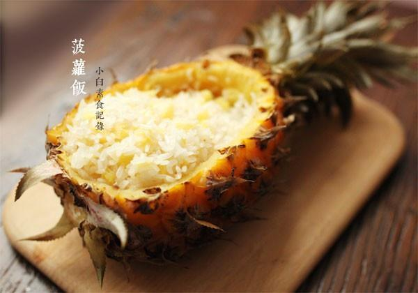

# 菠萝饭

## 📋 基本資訊 / Recipe Overview
- **料理名稱**：菠萝饭
- **原始標題**：菠萝饭
- **素食流派 / Diet**：全素 Vegan
- **料理分類 / Category**：米食主食
- **來源平台 / Source**：[下廚房 · 素食主義專區](https://www.xiachufang.com/recipe/1017020/)

## 🌿 食材及佐料清單 / Ingredients
- 1/3碗香米
- 一个菠萝
- 1/3碗糯米

## 🍳 烹飪步驟 / Step-by-Step Cooking Steps
1. 菠萝从侧面1/4处切开，然后用勺子将里面的果肉都挖出，如图。留少许切成丁，剩下的菠萝肉吃掉~糯米和香米提前一夜用水浸泡，然后与菠萝丁一起拌匀填入菠萝中，加水即将没过米
2. 将菠萝盖子盖在上面，用牙签固定，放入蒸锅蒸40分钟。如果没有那么大的锅子，可以将菠萝的一半浸入锅中，盖上盖子蒸煮
3. 这里说的米量的碗是小碗，但是实际分量要根据菠萝的大小来调整

## 💡 大廚美味秘訣 / Chef's Tips
- 菠萝饭~一半香米一半糯米，软糯香甜正合适，个人不喜欢添加太多东西，还是原味最美

---
*食譜歸檔時間：2026-08-20 · 來源：下廚房 (www.xiachufang.com)*