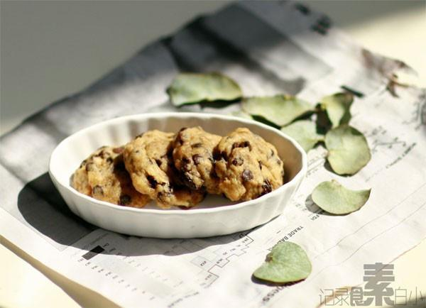

# 葡萄干软曲奇

## 📋 基本資訊 / Recipe Overview
- **料理名稱**：葡萄干软曲奇
- **原始標題**：葡萄干软曲奇
- **素食流派 / Diet**：全素 Vegan
- **料理分類 / Category**：面食主食
- **來源平台 / Source**：[下廚房 · 素食主義專區](https://www.xiachufang.com/recipe/1000437/)

## 🌿 食材及佐料清單 / Ingredients
- 100克低筋面粉
- 50克葡萄干
- 50克热水
- 20克红糖
- 50克植物油
- 1/4小勺盐
- 1小勺泡打粉

## 🍳 烹飪步驟 / Step-by-Step Cooking Steps
1. 红糖和热水混合，搅拌至红糖融化，冷却待用 葡萄干提前用水(配方分量外)泡半个小时
2. 容器里倒入植物油，再倒入红糖水、盐混合均匀
3. 泡打粉和低筋面粉混合筛入容器
4. 把面粉和植物油混合物搅拌成面糊
5. 加入滤干水的葡萄干，拌匀
6. 将面糊用小勺挖起铺在烤盘上，或者把面糊装入裱花袋，在烤盘上挤出均匀大小并轻轻压平
7. 烤箱预热5分钟，放入饼干，中层上下火，180度12分钟

## 💡 大廚美味秘訣 / Chef's Tips
- 无蛋无奶 
参考君之的方子减了糖

---
*食譜歸檔時間：2026-08-20 · 來源：下廚房 (www.xiachufang.com)*