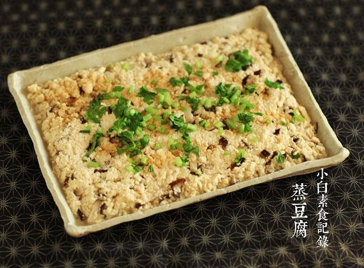

# 蒸豆腐饼

## 📋 基本資訊 / Recipe Overview
- **料理名稱**：蒸豆腐饼
- **原始標題**：蒸豆腐饼
- **素食流派 / Diet**：全素 Vegan
- **料理分類 / Category**：面点小吃
- **來源平台 / Source**：[下廚房 · 素食主義專區](https://www.xiachufang.com/recipe/1071156/)

## 🌿 食材及佐料清單 / Ingredients
- 1大匙榨菜碎
- 一块老豆腐（北豆腐）
- 2朵鲜香菇
- 1大匙生抽
- 一点点香油
- 一点香芹
- 一片生姜

## 🍳 烹飪步驟 / Step-by-Step Cooking Steps
1. 老豆腐用勺子碾碎待用。榨菜切碎，香菇切碎，姜一片切末，（香菇和榨菜要切的够碎~姜要切的快成泥）锅烧热下少许油将姜末和香菇碎煸香，然后与榨菜碎一起放入豆腐中拌匀
2. 取一只盘子，将混合物放入盘中压平压实（这点很重要，会影响口感，请务必要用力压实压紧），蒸锅加足量水，烧开，将盘子放入蒸锅大火蒸七八分钟~这时豆腐饼出了奶白色的汤汁~将香芹碎（或者你喜欢的其他比如香菜啊葱啊）撒在豆腐饼上，关火，盖上锅盖闷一下，芹菜香味就出来了
3. 取出盘子，均匀淋上生抽和几滴香油即可

## 💡 大廚美味秘訣 / Chef's Tips
- 如果你能找到臭豆腐的话~不妨这样蒸来试试，去掉榨菜香菇一样鲜美的不得了，真的不怎么臭的~而是很鲜

---
*食譜歸檔時間：2026-08-20 · 來源：下廚房 (www.xiachufang.com)*