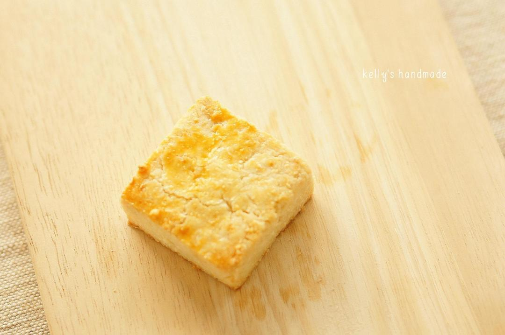

# 蓝罐曲奇配方分享

## 📋 基本資訊 / Recipe Overview
- **料理名稱**：蓝罐曲奇配方分享
- **原始標題**：蓝罐曲奇配方分享
- **素食流派 / Diet**：奶素 Lacto-Vegetarian
- **料理分類 / Category**：面食主食
- **來源平台 / Source**：[下廚房 · 素食主義專區](https://www.xiachufang.com/recipe/100390111/)

## 🌿 食材及佐料清單 / Ingredients
- 160g发酵黄油（据石小团童鞋的经验 发酵黄油才有蓝罐独特的风味 请不要用普通黄油）
- 200g低粉
- 80g椰蓉
- 50g糖粉
- 100g淡奶油
- 1小勺泡打粉
- 1/2小勺盐

## 🍳 烹飪步驟 / Step-by-Step Cooking Steps
1. 1.椰蓉焙香至金黄色 晾凉备用
2. 2.黄油软化 加入糖粉 打发至发白
3. 多次少量加入淡奶油 打至完全融合 奶油成蓬松白色 蓬松轻盈 不会出现油水分离和乳液状。
4. 筛入低粉 泡打粉和盐 加入椰蓉 切拌均匀
5. 虽然加入了分量不少的淡奶油 但是成型的饼干质感应该像普通造型曲奇一样湿软而蓬松 可以通过花嘴轻松挤出 也可以做冰箱饼干。
6. 建议撒上砂糖 我第二次做时尝试过了 确实有酥脆丰富的口感。
175度 18分钟左右 中层 上下火 至金黄色。

## 💡 大廚美味秘訣 / Chef's Tips
- ps：
1.选择淡奶油是因为国内无论牛奶还是奶粉都已经到了‘可以淡出鸟来’的地步 我尝试过加入20g奶粉 吃到了一嘴香精味和奶腥味。
2.如果觉得不够香 可以加入一包椰子粉。
3.如果加入了一包椰子粉还觉得没有蓝罐的香味 那么我认为你吃到的是国内的蓝罐曲奇。
——说这话绝对没有其他含义^_^

下一章是珍妮曲奇配方揭晓···
期待大家提出更多的建议 不要让美味只留在记忆里。

---
*食譜歸檔時間：2026-08-20 · 來源：下廚房 (www.xiachufang.com)*