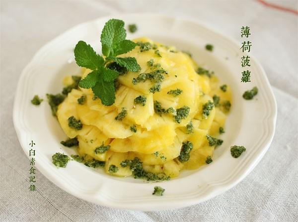

# 薄荷菠萝

## 📋 基本資訊 / Recipe Overview
- **料理名稱**：薄荷菠萝
- **原始標題**：薄荷菠萝
- **素食流派 / Diet**：全素 Vegan
- **料理分類 / Category**：家常蔬食 / 经典热菜
- **來源平台 / Source**：[下廚房 · 素食主義專區](https://www.xiachufang.com/recipe/1040553/)

## 🌿 食材及佐料清單 / Ingredients
- 新鲜菠萝
- 一小把新鲜薄荷叶
- 2大匙砂糖

## 🍳 烹飪步驟 / Step-by-Step Cooking Steps
1. 去好皮的菠萝切片，去掉硬心，放淡盐水中泡一会
2. 薄荷去掉梗留下叶，洗净，控干水分~一定要控干水！然后剁碎与2大匙砂糖一起捣一捣，糖就绿了，撒泡好的菠萝上，开吃

## 💡 大廚美味秘訣 / Chef's Tips
- 挑选菠萝的方法，抽一片靠中间的菠萝叶，很容易抽出的就是熟透了。 
做薄荷砂糖，薄荷少，糖多，注意控制薄荷中的水分，否则就成糖水了

---
*食譜歸檔時間：2026-08-20 · 來源：下廚房 (www.xiachufang.com)*