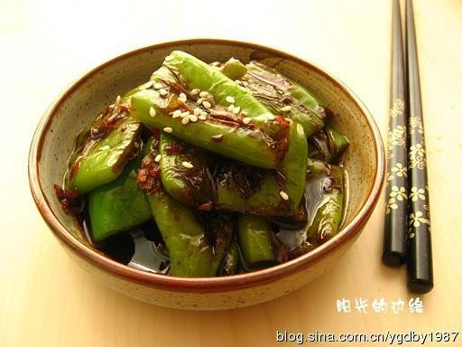

# 虎皮尖椒

## 📋 基本資訊 / Recipe Overview
- **料理名稱**：虎皮尖椒
- **原始標題**：虎皮尖椒
- **素食流派 / Diet**：全素 Vegan
- **料理分類 / Category**：家常蔬食 / 经典热菜
- **來源平台 / Source**：[下廚房 · 素食主義專區](https://www.xiachufang.com/recipe/247502/)

## 🌿 食材及佐料清單 / Ingredients
- 3个尖椒
- 3勺生抽
- 2勺米醋
- 1勺糖
- 2瓣蒜
- 少许植物油

## 🍳 烹飪步驟 / Step-by-Step Cooking Steps
1. 尖椒洗净切段，蒜切末，料汁调好
2. 平底锅烧热，不放油，直接放尖椒烙
3. 用勺子逐个压一会儿，会听到水汽都出来的声音，烙至变软，两面有焦斑
4. 把尖椒盛出，锅中倒植物油烧热，放入蒜末煸炒
5. 再放入尖椒，放入生抽、醋和糖，烧入味即可出锅

## 💡 大廚美味秘訣 / Chef's Tips
- P.S.： 
这道菜是我超爱的懒人菜，没想到在下厨房这么受欢迎哦。 
那就再补充几点哈。 
首先，虎皮尖椒应该是不切断，要完整的煎和烧。 
但我是那种不太能吃辣的人，所以不敢把买来的尖椒直接做了。 
而且拍照的这次做的比较少，就切段来煎了。 
如果大家做的多，又不怕辣，建议还是整个儿的烧哈。 
然后说说尖椒很辣的问题。 
根据经验，买的时候尽量买个头比较大的，看上去皮比较厚的。 
把子部分比较直一些的，这种尖椒一般不会太辣。 
又薄又小，把子还细细弯弯的，通常很辣。 
不过，这个挑选的方法也不是百分百准确，只能说大部分情况是准的。 
如果还是买到很辣的尖椒，可以去蒂去籽，用小刀把白色的筋膜削掉，这样就不怎么辣了。 
如果一丁点辣都不能吃，就一定要彻底的切除白色筋膜，然后把菜板，刀子和尖椒都用水洗一下，再切成需要的形状，这样就没有任何辣味了。 
还有什么要说的呢？额，汤汁。 
有些童鞋问我菜谱里的勺子是多大的。 
其实我说的勺就是个计量单位，给大家一个比例而已。 
因为每个尖椒还不一样重呢，不好量化。 
我做菜的习惯，是喜欢先把需要的调料调一个汤汁， 
烧菜的时候倒进去就好了。 
如果拿不准多少尖椒淋多少汤汁， 
可以先按照比例多调一些，烧的时候再慢慢加，直到你觉得合适为止。 
当然了，我的汤汁比例仅供参考，请根据自己口味调整哈。 
这个菜如果想拌饭，最后烧完是要带着一些汤汁的。 
我没有放盐，纯粹靠生抽的味道调整咸度， 
我觉得这样味道刚刚好！ 
但如果你喜欢清淡的味道，就少放料汁，用盐调味。

---
*食譜歸檔時間：2026-08-20 · 來源：下廚房 (www.xiachufang.com)*