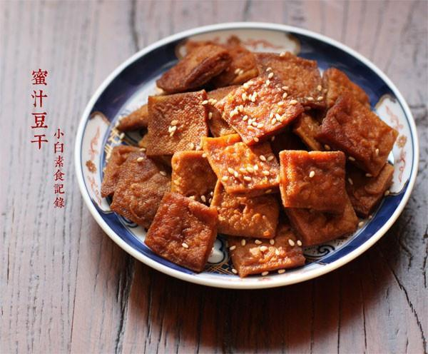

# 蜜汁豆干

## 📋 基本資訊 / Recipe Overview
- **料理名稱**：蜜汁豆干
- **原始標題**：蜜汁豆干
- **素食流派 / Diet**：全素 Vegan
- **料理分類 / Category**：家常蔬食 / 经典热菜
- **來源平台 / Source**：[下廚房 · 素食主義專區](https://www.xiachufang.com/recipe/1012965/)

## 🌿 食材及佐料清單 / Ingredients
- 一斤白豆腐干
- 3大匙糖
- 1大匙老抽
- 1小匙盐
- 一两个八角
- 一点点香油
- 少许熟芝麻

## 🍳 烹飪步驟 / Step-by-Step Cooking Steps
1. 无味的白豆腐干，如图上这种，切成2厘米的小块，块太大会容易碎
2. 锅烧热下适量油，下入豆干煸炒或煎至表面金黄
3. 锅中留少许底油，下入3大匙糖小火炒化，继续加热至冒泡，颜色变深黄，然后下入豆腐干炒匀上色
4. 锅中加入豆腐干2/3的水，约一碗，接着加入老抽、盐和八角，大火烧开后小火炖煮
5. 让豆腐干入味。当汤汁变少时不停翻炒大火收汁，汤汁都收干了关火，滴一点点香油拌匀，撒上熟芝麻即可

## 💡 大廚美味秘訣 / Chef's Tips
- 1.糖用普通白糖或者冰糖粉都可以，炒糖色的时候一定要小火，注意火候，炒过了会发苦 
2.吃蜂蜜的也可以关火后加少许蜂蜜拌匀。今天的这个甜度不是特别甜，可以根据口味增加糖量 
3.喜欢吃有嚼劲一点的可以将豆干平摊在盘中自然风干一夜

---
*食譜歸檔時間：2026-08-20 · 來源：下廚房 (www.xiachufang.com)*