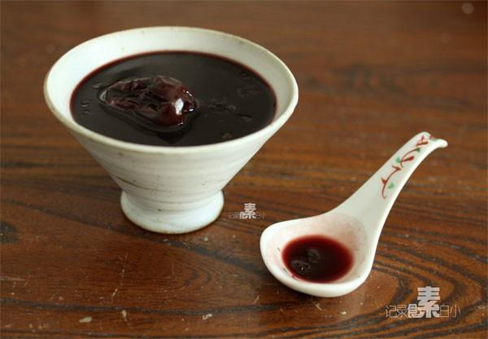

# 血糯红枣粥

## 📋 基本資訊 / Recipe Overview
- **料理名稱**：血糯红枣粥
- **原始標題**：血糯红枣粥
- **素食流派 / Diet**：全素 Vegan
- **料理分類 / Category**：米食主食
- **來源平台 / Source**：[下廚房 · 素食主義專區](https://www.xiachufang.com/recipe/1010120/)

## 🌿 食材及佐料清單 / Ingredients
- 血糯米
- 红枣
- 红糖

## 🍳 烹飪步驟 / Step-by-Step Cooking Steps
1. 血糯米和红枣放入锅中，加足量水，大火烧开后转小火煮半个小时2.关火前加入红糖拌匀， 懒的童鞋也可以直接用电饭锅~

## 💡 大廚美味秘訣 / Chef's Tips
- 经常有童鞋问，素食者如何补血。大自然早就给我们准备了丰富的资源~ 
 
血糯米是带有紫红色的种皮的大米，因为米质有糯性，所以称为血糯 
功效：具有养肝、养颜、泽肤等功效，适用于营养不良、面色苍白、皮肤干燥及身体瘦弱者食用。年轻女性不妨适当食用血糯米，以起到养颜护肤的作用。红色的血糯米，入心经，心主血，它的功效是滋补气血。 
 
小白是在淘宝买的江苏常熟产的血糯米，想买的自行搜索~ 
这款三种红色原料熬出的超级补血粥有非常好的补血养颜效果

---
*食譜歸檔時間：2026-08-20 · 來源：下廚房 (www.xiachufang.com)*