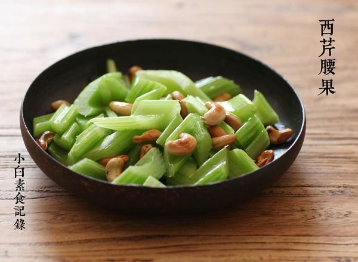

# 西芹腰果

## 📋 基本資訊 / Recipe Overview
- **料理名稱**：西芹腰果
- **原始標題**：西芹腰果
- **素食流派 / Diet**：全素 Vegan
- **料理分類 / Category**：家常蔬食 / 经典热菜
- **來源平台 / Source**：[下廚房 · 素食主義專區](https://www.xiachufang.com/recipe/1089673/)

## 🌿 食材及佐料清單 / Ingredients
- 西芹
- 一把腰果
- 1/2小匙盐

## 🍳 烹飪步驟 / Step-by-Step Cooking Steps
1. 西芹，用削皮刀把靠近根部的外侧的过于粗的纤维削掉，省得塞牙~其他部分的不妨保留，吃点粗纤维有助消化~当然如果喜欢嫩嫩的口感也可以把外皮都削掉。然后用刀斜切成块，斜切不光好看，因为横截面大，在最后加盐短暂的拌炒时会很容易入味。 
腰果，生腰果的话用烤箱180度烤七八分钟，比中式菜传统的炸制健康也不会腻。
2. 锅烧热下一点油，下西芹翻炒颜色翠绿加入腰果和盐拌匀即可。如果有的童鞋对火候掌握不好不妨先烧一锅水，把西芹放入焯烫半分钟，捞出来过下冷水，然后再拌炒一下即可

## 💡 大廚美味秘訣 / Chef's Tips
- 这道菜真的不需要盐以外的任何调味料

---
*食譜歸檔時間：2026-08-20 · 來源：下廚房 (www.xiachufang.com)*