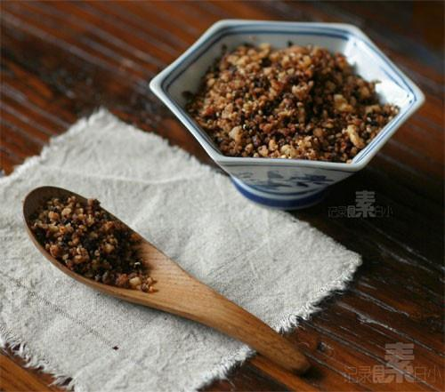

# 豆渣变身豆松

## 📋 基本資訊 / Recipe Overview
- **料理名稱**：豆渣变身豆松
- **原始標題**：豆渣变身豆松
- **素食流派 / Diet**：全素 Vegan
- **料理分類 / Category**：家常蔬食 / 经典热菜
- **來源平台 / Source**：[下廚房 · 素食主義專區](https://www.xiachufang.com/recipe/1001392/)

## 🌿 食材及佐料清單 / Ingredients
- 海苔碎
- 豆渣
- 生抽
- 红糖
- 熟芝麻

## 🍳 烹飪步驟 / Step-by-Step Cooking Steps
1. 豆渣充分沥干水分，布的滤网滤干效果最好
2. 不粘锅烧热下少许油，放入豆渣小火不停翻炒，直到豆渣干到不会沾到一起，如果豆渣滤干的好，这一步时间就可以大大缩短
3. 加入少许红糖和稍多的生抽调味继续炒干
4. 最后加熟芝麻和海苔碎拌匀即可

## 💡 大廚美味秘訣 / Chef's Tips
- 豆渣扔掉总觉得可惜 
这个方法可以做出好吃的豆松

---
*食譜歸檔時間：2026-08-20 · 來源：下廚房 (www.xiachufang.com)*