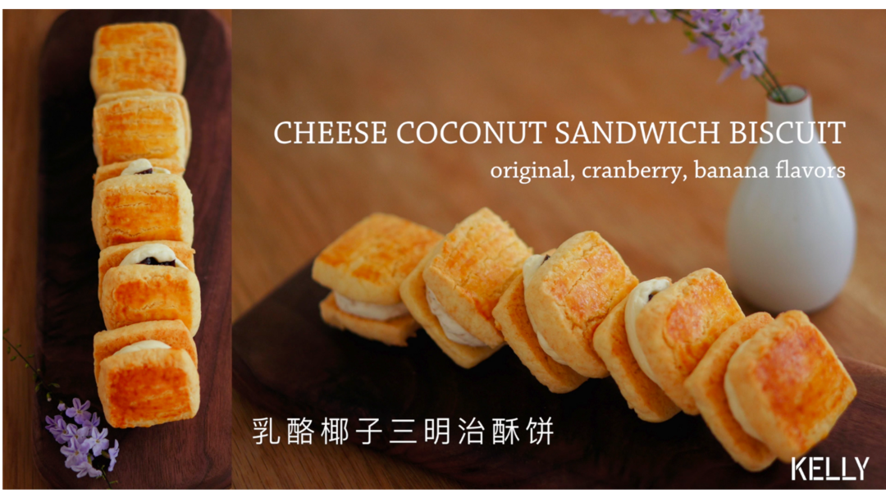

# 酥软馥郁的乳酪椰子三明治酥饼 烘焙视频饼干篇8

## 📋 基本資訊 / Recipe Overview
- **料理名稱**：酥软馥郁的乳酪椰子三明治酥饼 烘焙视频饼干篇8
- **原始標題**：酥软馥郁的乳酪椰子三明治酥饼/烘焙视频饼干篇8
- **素食流派 / Diet**：蛋奶素 Ovo-Lacto
- **料理分類 / Category**：面食主食
- **來源平台 / Source**：[下廚房 · 素食主義專區](https://www.xiachufang.com/recipe/102822229/)

## 🌿 食材及佐料清單 / Ingredients
- #椰香饼干胚。配方可做饼干8块（16片），括号内分量可做32块（64片）#
- 60g（240g）黄油
- 1个（4个）蛋黄
- #装在一个盆子里#
- 100g（400g）低筋面粉
- 1/4小勺「1g」（1小勺「4g」）泡打粉
- 20g（80g）椰蓉
- #装在一个盆子里#
- 50g（200g）糖粉
- 1/4小勺「1g」（1/2小勺「2g」）盐
- #夹馅原料。可制作8块饼干，括号内的分量可制作32块#
- 65g（250g）奶油奶酪
- 25g（100g）黄油
- 几滴香草精
- 10g（40g）糖粉
- 适量莓子味：额外添加蔓越莓干
- 一小只（果肉重约80g）香蕉味：额外添加成熟香蕉

## 🍳 烹飪步驟 / Step-by-Step Cooking Steps
1. 黄油提早软化备用。
2. 软化好的黄油打散。
3. 加入糖粉和盐。
4. 搅打均匀。
5. 加入蛋黄。
6. 搅打蓬松。
7. 筛入低筋面粉，泡打粉和椰蓉。
（过筛椰蓉是为了混入空气打散结块）
8. 筛不过的椰蓉倒入盆子里。
9. 从四周向中间压拌均匀。
10. 成为偏干的面糊。
11. 撕下保鲜膜，左右各长15cm。
12. 四指压下四角。
13. 填入面糊。
14. 用抹勺压平表面。
15. 盖上前后的保鲜膜。
16. 双手形成90°夹角整形饼干。
17. 翻转饼干，拉动保鲜膜把饼干拉到一侧。
18. 捋平表面，抹平背面的缝隙。
19. 冷藏4小时以上至面糊结实。
（或冷冻半小时定型。建议如有时间冷藏过夜，由内而外固化面糊。）
取出切片前烤箱预热至175℃。
烤盘铺硅油纸备用。
20. 饼干切成厚薄均匀的片状。
21. 另取一枚蛋黄过筛
（过筛可以去除结块消掉气泡，避免烤出的饼干表面有一坨坨的蛋黄——那就很丑了）
倒入适量淡奶油。
（蛋黄液较稠，添加淡奶油可以稀释蛋黄同时使上色更均匀（不会太黄），同时避免上色过度。如果没有淡奶油，可以加一点牛奶兑开）
22. 搅拌至稠度适中。
23. 轻轻刷在饼干表面。
（不要像抹腻子一样死命刷啊··· 温柔一点温柔一点）
24. 175℃，中层，20分钟左右，直至表面金黄。
取出晾凉，刚刚拿出来的时候中间会比较酥软，但冷却后是干硬的，如果还是软软的，说明没有烤到位，要回炉烘干。
25. 等待饼干冷却时我们来做夹馅用乳酪霜。
奶酪和黄油提早软化备用。
今天我们会做3种口味，分别是原味，莓子味和香蕉味。
听起来很繁琐——然而并不_(:зゝ∠)_。
下面会介绍一种非常简易的多口味做法，大家可以自己选择。
26. 蔓越莓干可以换成葡萄干（注意：如果葡萄干比较硬，要用清水泡洗后用厨房纸擦干再用）
香蕉肉可以换成榴莲/芋泥/栗子，制作不同口味的乳酪霜。
ps：前文的南瓜乳酪霜也可用于这款饼干夹馅。
27. 如果只想做8块原味馅饼，蔓越莓和香蕉都不要下，按括号前的分量操作即可。
如果只想做8块蔓越莓馅饼，不要下香蕉，按括号前的分量操作，挤完放上蔓越莓干即可。
如果只想做8块香蕉馅饼，请按此配方：奶油奶酪 60g 黄油 20g 糖粉 10g 熟香蕉肉 80g
28. 奶酪压碎。
29. 低速打散。
30. 倒入糖粉。
31. 压拌至没有干粉。
32. 滴几滴香草精。
33. 继续打匀。
34. 黄油软化到位，中速打发。
35. 直到体积膨胀，颜色变浅。
36. 倒回乳酪霜中。
37. 搅打均匀后低速缓提甩掉打蛋头上的黄油糊。
38. 取一口杯撑开袋子。
39. 将其中2/3装入裱花袋。
（剩余1/3用来制作乳酪霜）
40. 装好后虎口顺势拧紧，再剪开开口，
41. 接下来制作香蕉奶酪霜。剥下一根香蕉到剩余的乳酪糊里。
（越熟的香蕉香气越浓，请选择熟透了表面有黑点的香蕉）
42. 用力大致压碎（如果刮刀很软，可以改用汤勺）
43. 低速打匀。
44. 装入裱花袋。
45. 虎口收紧，剪开开口。
46. 左手持抹刀轻轻把一半饼干翻过来（注意：是一半~）
47. 挤上一大球乳酪霜。
（收口时轻轻放松向上提起）
48. 莓子味的馅饼，在圆球表面压下几枚蔓越莓干。
对我用的是筷子(⊙v⊙)
再挤上一小坨乳酪霜。
49. 盖上剩余的饼干片。
50. 密封冷藏保存至少一日以上，使内陷和饼干相互融合。
51. 冷藏后食用，内陷丝滑冰凉像冰淇淋，饼干酥松又带有类似椰子球的酥软，是非常美味的组合。
尽情享受吧~

## 💡 大廚美味秘訣 / Chef's Tips
- 公众号搜索爱烘焙的阿猪，可以找到提纲挈领的重点详解。

表皮焦酥喷香，饼干松香绵软，冷藏后的乳酪馅丝滑细腻，相互融合丝丝入扣。
务必冷藏一日后食用，表皮吸收了馅料的水分会变得酥软，像在舔冰淇淋。

重复一遍，冷藏后更好吃喔~
（阿猪把大小配方都计算好了，大量制作时按括号里分量即可，不用换算啦~）
鬼怪蛋糕中的南瓜乳酪霜亦可用于夹馅：http://www.xiachufang.com/recipe/102817816/

由浅入深的基础烘焙视频合辑：https://www.xiachufang.com/recipe_list/107044141/
花嘴选购和工具型号看这个~https://www.xiachufang.com/recipe/102299400/

---
*食譜歸檔時間：2026-08-20 · 來源：下廚房 (www.xiachufang.com)*