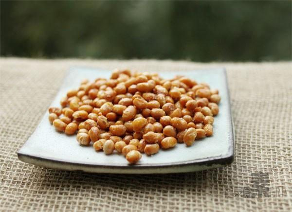

# 酥黄豆

## 📋 基本資訊 / Recipe Overview
- **料理名稱**：酥黄豆
- **原始標題**：酥黄豆
- **素食流派 / Diet**：全素 Vegan
- **料理分類 / Category**：面点小吃
- **來源平台 / Source**：[下廚房 · 素食主義專區](https://www.xiachufang.com/recipe/1006071/)

## 🌿 食材及佐料清單 / Ingredients
- 一杯黄豆

## 🍳 烹飪步驟 / Step-by-Step Cooking Steps
1. 做法一：适合掌握不好火候，怕迸油的新手 1.黄豆浸泡一夜，捞出沥干水分，放入锅中，倒冷油没过黄豆 2.开小火，慢炸约15分钟左右，锅里不怎么噼里啪啦了就差不多了 捞出用吸油纸吸下油，撒点盐，晾凉后更酥脆~
2. 做法二：需要一定的经验，要把握好火候 1.黄豆浸泡一夜，捞出沥干水分 2.锅中下油，烧至五成热（约100度），下入黄豆炸两三分钟（可能动静会挺大的，不要怕~） 3.捞出黄豆晾一会，再次开火将油烧到五成热，下入黄豆回锅炸到不会噼里啪啦的即可

## 💡 大廚美味秘訣 / Chef's Tips
- 可以用来做担担面、酸辣粉的配料~来勺这个确实更正宗好吃 
 也可以给家里的男同志当小菜当零食~ 
 
 晾凉后放干燥地方保存可放2周左右

---
*食譜歸檔時間：2026-08-20 · 來源：下廚房 (www.xiachufang.com)*