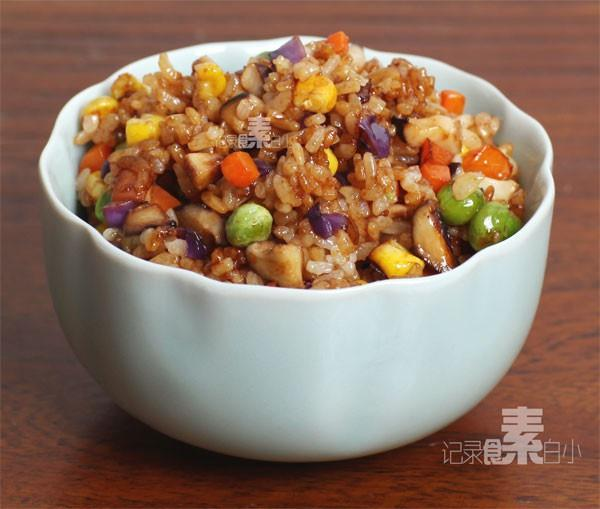

# 酱油素炒饭

## 📋 基本資訊 / Recipe Overview
- **料理名稱**：酱油素炒饭
- **原始標題**：酱油素炒饭
- **素食流派 / Diet**：全素 Vegan
- **料理分類 / Category**：米食主食
- **來源平台 / Source**：[下廚房 · 素食主義專區](https://www.xiachufang.com/recipe/1005248/)

## 🌿 食材及佐料清單 / Ingredients
- 2小碗米饭
- 2朵香菇
- 紫甘蓝
- 青豆
- 玉米
- 胡萝卜
- 1/2小匙老抽
- 1小匙生抽
- 1/2小匙糖

## 🍳 烹飪步驟 / Step-by-Step Cooking Steps
1. 熟米饭用勺子搅散，加入生抽、老抽、白糖拌均匀待用
2. 胡萝卜、紫甘蓝切丁，香菇去蒂切丁，速冻的青豆玉米粒解冻
3. 锅烧热下入少量油，先下香菇和胡萝卜炒香，再下青豆玉米粒炒匀
4. 下入拌好的米饭和紫甘蓝碎一同小火炒匀即可

## 💡 大廚美味秘訣 / Chef's Tips
- 1.先用酱油拌匀米饭这个方法对新手来说很方便，避免炒不匀 
2.菜码可以根据情况变化，都切成小丁就是 
 3.米饭下炒锅后最好炒的久一点，这样会粒粒分明，而且亮亮的~

---
*食譜歸檔時間：2026-08-20 · 來源：下廚房 (www.xiachufang.com)*