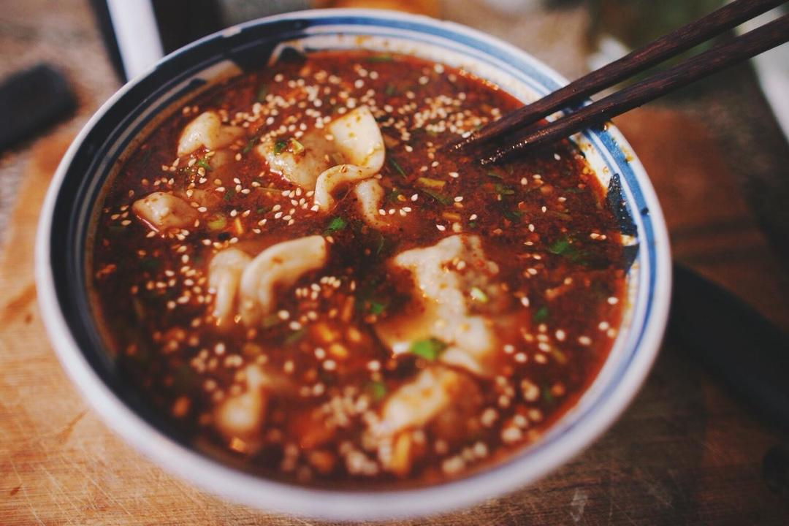

# 酸汤水饺

## 📋 基本資訊 / Recipe Overview
- **料理名稱**：酸汤水饺
- **原始標題**：酸汤水饺
- **素食流派 / Diet**：全素 Vegan
- **料理分類 / Category**：养生汤品
- **來源平台 / Source**：[下廚房 · 素食主義專區](https://www.xiachufang.com/recipe/1011813/)

## 🌿 食材及佐料清單 / Ingredients
- 熟芝麻
- 南食召的醋2-3小勺，普通香醋3-6小勺。醋
- 香油
- 油泼辣子
- 香菜
- 八角
- 桂皮
- 香叶
- 花椒
- 酱油
- 虾皮

## 🍳 烹飪步驟 / Step-by-Step Cooking Steps
1. 根据需要制作的量一碗饺子半碗水（以此类推），放入适量的八角、桂皮、香叶、花椒等同煮（香料有就可以，不要多，不然会抢汤味）
2. 水开后倒入刚才煮水量三分之二左右的醋，再次煮开后，捞出锅内香料，小火继续煮
3. 大约10分钟左右，醋的香味都出来，酸涩味都煮没了，酸汤底就算好了
4. 准备一只空碗，碗底放熟芝麻、盐、油泼辣子、少许酱油、醋（酱油醋一定要少，如果不够再根据口味来添加）再加入半碗准备好的酸汤底
5. 捞出煮熟的饺子放入碗中
6. 自己尝下味道，可以根据口味添加饺子汤、醋、盐、辣椒、酸汤底等等
7. 以上搞定后，加入香菜末、香油（正宗的还要再放牛油）就可以吃了

## 💡 大廚美味秘訣 / Chef's Tips
- 这个做法的酸汤底跟西安那些老字号肯定还是没有办法比的~ 但是算的上是家常酸汤水饺最正宗的了！ 
我已经试过多次，家里超级爱吃酸汤水饺的那只很满意这个酸汤~

---
*食譜歸檔時間：2026-08-20 · 來源：下廚房 (www.xiachufang.com)*