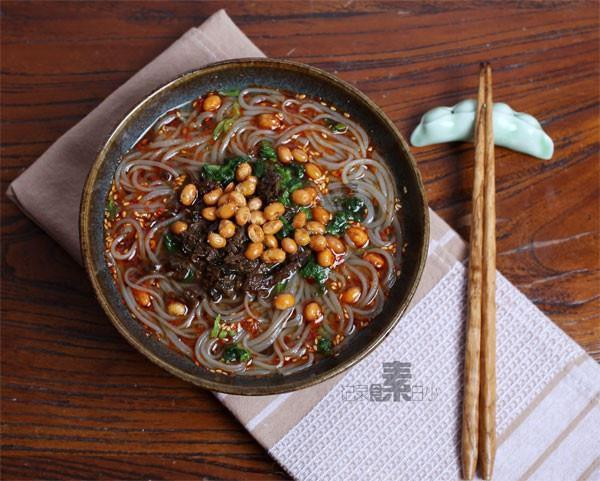

# 酸辣粉

## 📋 基本資訊 / Recipe Overview
- **料理名稱**：酸辣粉
- **原始標題**：酸辣粉
- **素食流派 / Diet**：全素 Vegan
- **料理分類 / Category**：面食主食
- **來源平台 / Source**：[下廚房 · 素食主義專區](https://www.xiachufang.com/recipe/1006195/)

## 🌿 食材及佐料清單 / Ingredients
- 1大匙香芹碎
- 1大匙碎米芽菜
- 一份红薯粉
- 1大匙辣椒油
- 1大匙醋
- 1大匙生抽
- 1小匙香油
- 1/2小匙糖
- 1/2小匙盐
- 1/2小匙花椒粉
- 1大匙酥黄豆

## 🍳 烹飪步驟 / Step-by-Step Cooking Steps
1. 锅中烧开水，下入红薯粉丝煮5分钟左右
2. 利用煮粉丝的时间，取一只大碗，调入辣椒油、香油、花椒粉、陈醋、生抽、盐、糖待用
3. 将煮好的粉丝连同锅中的水倒入调好调料的碗中
4. 撒上酥黄豆、炒过的碎米芽菜、香芹碎拌匀即可食用

## 💡 大廚美味秘訣 / Chef's Tips
- 1.酥黄豆的做法前天刚刚发过，请见前天内容 
2.碎米芽菜是用芥菜剁碎腌渍成，有卖一小包一小包的，锅中放油炒过后食用，可省略 
 3.喜欢可放点绿叶菜在里面 
 4.香芹碎的保存方法：香芹洗净用水焯熟，挤干水分，切碎冷冻，随用随取。 
酸辣粉的做法也有很多种，今天做的算是配料比较简易的了~但是味道还是很正哒~ 
酸酸辣辣~最后连汤喝掉最舒服

---
*食譜歸檔時間：2026-08-20 · 來源：下廚房 (www.xiachufang.com)*