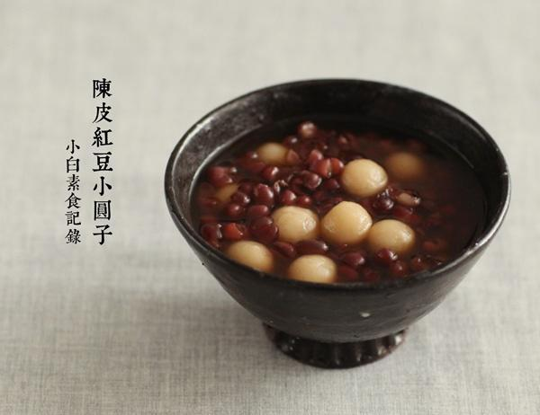

# 陈皮红豆小圆子

## 📋 基本資訊 / Recipe Overview
- **料理名稱**：陈皮红豆小圆子
- **原始標題**：陈皮红豆小圆子
- **素食流派 / Diet**：全素 Vegan
- **料理分類 / Category**：面食主食
- **來源平台 / Source**：[下廚房 · 素食主義專區](https://www.xiachufang.com/recipe/1077184/)

## 🌿 食材及佐料清單 / Ingredients
- 100g糯米粉
- 90g水
- 半碗红小豆
- 一块陈皮
- 适量红糖

## 🍳 烹飪步驟 / Step-by-Step Cooking Steps
1. 先做糯米小圆子，100g的糯米粉可以做一盘，一个人吃不了，做好了可以直接装袋冷冻，随吃随取很是方便。 
100g糯米粉用90g温水一起揉成团，然后搓成长条，揪成小块放在两手之间搓成球，直径大概1.5cm.都搓好后撒上干的糯米粉防止粘到一起~
2. 红小豆浸泡一夜，放入电饭锅加五六倍的水，用煮饭档煮熟，根据情况再适当加点水，加一小块陈皮和红糖煮至水开，下小圆子煮5分钟即可。

## 💡 大廚美味秘訣 / Chef's Tips
- 因为元旦那天感冒，在苏天使家喝了老白茶新会陈皮一起泡，出了很多汗很舒服，然后自己也寻了点陈皮，搓了小圆子，和红豆一起煮了这道暖和的甜品，我还是很喜欢陈皮和红豆一起煮的香味的。 
陈皮有理气健脾，调中，燥湿，化痰之效。 
另外，感冒了请吃药，这个治不了病哈哈，经常有人问我生了什么什么病，吃什么好，嗯，实实在在的回到您，吃药，看医生，人的体质不同，病因多种多样，最关键的是我不是医生啊亲~

---
*食譜歸檔時間：2026-08-20 · 來源：下廚房 (www.xiachufang.com)*