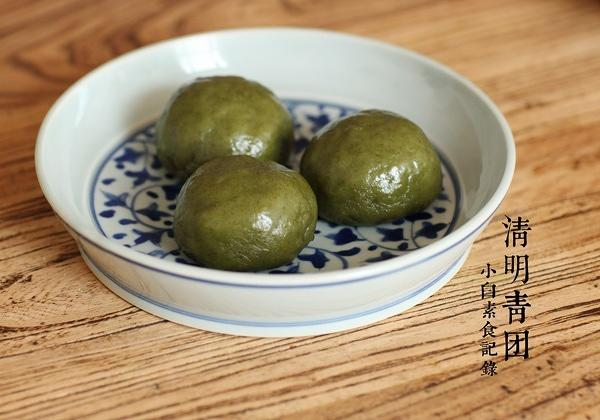

# 青团

## 📋 基本資訊 / Recipe Overview
- **料理名稱**：青团
- **原始標題**：青团
- **素食流派 / Diet**：全素 Vegan
- **料理分類 / Category**：面食主食
- **來源平台 / Source**：[下廚房 · 素食主義專區](https://www.xiachufang.com/recipe/1088192/)

## 🌿 食材及佐料清單 / Ingredients
- 90G红小豆
- 30G红糖
- 135g糯米粉
- 25g糖
- 30g新鲜艾草嫩叶
- 90g水

## 🍳 烹飪步驟 / Step-by-Step Cooking Steps
1. 提前做好红豆馅，豆沙或豆粒的都可以，依个人喜好。90g红小豆泡一下或者不泡，放电饭锅加3倍水慢慢煮，利用预热再闷半小时一小时的。豆软熟了即可，加入红糖放入锅中炒至水分蒸发的差不多，晾凉后分成8小团待用。（如想要豆沙就在豆煮好用用搅拌器打碎即可，我喜欢有豆子的口感于是在炒的过程中用勺子压一压，一半成砂，一半是豆）
2. 艾叶取嫩芽30G，洗净，锅中烧滚水下点盐，放入艾叶烫一下捞出，过下凉水（这样可以多保留点艾叶的绿）挤掉水分，加90G水用搅拌机打成泥待用
3. 把艾草泥与糯米粉和糖一起混合揉成光滑的面团（我用这个比例刚刚好，但是依湿度及面吸水程度不同请灵活掌握，干了加点水，湿了添点面）分成8等份，大约每个35G的剂子，团成团待用
4. 取一份放在两手之间用手掌的力量一边转一边压扁，当然如果你想用擀面杖也成，中间放上一份豆馅，收严口，翻过来~整圆
5. 蒸锅水烧开后蒸15分钟即可，刚刚整好会沾手，稍晾凉后就不粘了哈~

## 💡 大廚美味秘訣 / Chef's Tips
- 特别喜欢艾草的清香 
我妈说，我刚刚出生时就按照当地传统用艾叶水洗了人生第一个澡捏 
难怪我身体好不生病吼吼

---
*食譜歸檔時間：2026-08-20 · 來源：下廚房 (www.xiachufang.com)*