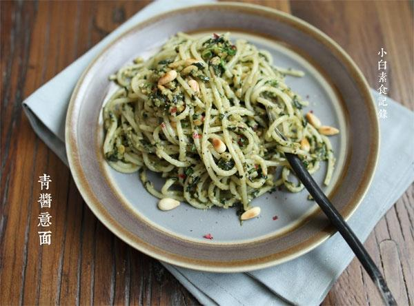

# 青酱意面

## 📋 基本資訊 / Recipe Overview
- **料理名稱**：青酱意面
- **原始標題**：青酱意面
- **素食流派 / Diet**：全素 Vegan
- **料理分類 / Category**：面食主食
- **來源平台 / Source**：[下廚房 · 素食主義專區](https://www.xiachufang.com/recipe/1062958/)

## 🌿 食材及佐料清單 / Ingredients
- 青酱（二人份）
- 一把罗勒叶
- 4大匙松子仁
- 1小匙盐
- 一点点黑胡椒粉
- 2大匙橄榄油
- 适量意面

## 🍳 烹飪步驟 / Step-by-Step Cooking Steps
1. 罗勒叶洗净切碎，松子仁去皮，放入平底锅中小火干炒香，把炒好的松子仁、罗勒碎、盐、胡椒、橄榄油一起放入搅拌机中打碎，如果不好打可适量添加点凉白开，打成稠糊状待用，不需要打的很细，有点颗粒更有口感
2. 锅中烧开大量的水，下入意面和1/2小匙盐同煮至八成熟(煮的时间根据意面的粗细情况而定，通常包装上会标明时间)捞出沥干水分
3. 将意面移入平底锅中，与青酱拌炒均匀即可

## 💡 大廚美味秘訣 / Chef's Tips
- 炒好的松子可留少许最后撒在面上~

---
*食譜歸檔時間：2026-08-20 · 來源：下廚房 (www.xiachufang.com)*