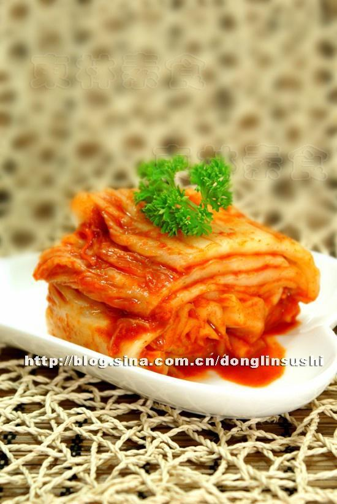

# 韩国泡菜

## 📋 基本資訊 / Recipe Overview
- **料理名稱**：韩国泡菜
- **原始標題**：韩国泡菜
- **素食流派 / Diet**：全素 Vegan
- **料理分類 / Category**：面食主食
- **來源平台 / Source**：[下廚房 · 素食主義專區](https://www.xiachufang.com/recipe/89840/)

## 🌿 食材及佐料清單 / Ingredients
- 韩国辣椒酱
- 大白菜
- 胡萝卜
- 白萝卜
- 辣椒粉
- 面粉
- 梨
- 姜

## 🍳 烹飪步驟 / Step-by-Step Cooking Steps
1. 那我们就是先剥去最外层2～３片叶片（留作它用），切这个大白菜,就是从菜头上面开始对切，不要切到底，切三分之一处，用手剥开（剥开好处：跟着纤维去撕开，腌渍时更容易入味）
2. 然后腌大白菜，腌大白菜之前不用洗，从菜心开始，一叶一叶把它掀开，用盐均匀撒在大白菜菜根茎部（菜叶不用撒盐了，腌渍时会出水，出的盐水正好腌渍叶子。叶子比较嫩一定先入味，梗部是最后入味）
3. 我们这个大白菜这样撒了盐，不能扣起来去腌喔，这样子所有的咸度都掉下来，一定是要让大白菜躺在盆中，所有的咸度才会进去。就这样躺８小时左右，让大白菜脱水软化，然后用腌渍出盐水，去洗净大白菜，控干水分待用
4. 然后制作面糊，用少许面粉，放入锅中加凉水，开火加热，加热时不停搅拌直至面糊成熟，待凉后待用
5. 生姜洗干净刮去皮，切末待用
6. 梨（苹果也可以）刨皮，擦成茸待用
7. 胡萝卜、白萝卜分别切成细丝待用
8. 辣椒粉用温水调成辣椒糊，冷却后待用
9. 然后把冷却后的面糊、姜末、梨茸、胡萝卜丝、白萝卜丝、冷却后辣椒糊全部放不锈钢盆中，最后加入最关键原料“韩国辣椒酱”、盐、蘑菇精全部拌匀待用
10. 然后将步骤（９）的调味料，均匀的涂抹在每一片大白菜上，然后将盆包上保鲜膜，放倒太阳晒不到的地方，发酵腌渍二天之后就可以食用了

## 💡 大廚美味秘訣 / Chef's Tips
- 韩国泡菜代表着韩国烹调文化，是韩国餐桌上从古到今一日三餐不可缺少的食品。韩国泡菜的基本材料是一样，很有特色，加上辣椒后口味发生变化，韩国先祖利用它创造了世界食品上伟大而重大的韩国泡菜。为什么叫伟大而重大的发明呢？因为发酵出来的有乳酸味道的泡菜是世界其他地方没有的。这要归功于辣椒的主成分“Capsaisin”，它能预防泡菜的酸败，起保持美味的作用。韩国过冬的泡菜像新鲜的蔬菜一样又脆又爽口，咬的时候甚至有清脆的声音。韩国妇女几乎都有一手做泡菜的绝活，经济好的家庭不仅用大白菜加工泡菜，其它蔬菜也可以做作成韩国泡菜。

---
*食譜歸檔時間：2026-08-20 · 來源：下廚房 (www.xiachufang.com)*