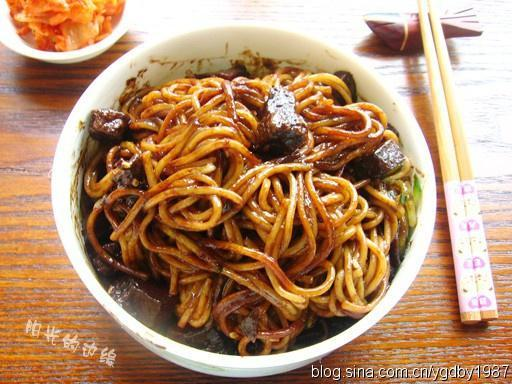

# 韩式炸酱面

## 📋 基本資訊 / Recipe Overview
- **料理名稱**：韩式炸酱面
- **原始標題**：韩式炸酱面
- **素食流派 / Diet**：全素 Vegan
- **料理分類 / Category**：面食主食
- **來源平台 / Source**：[下廚房 · 素食主義專區](https://www.xiachufang.com/recipe/100545/)

## 🌿 食材及佐料清單 / Ingredients
- 面
- 素鸡丁
- 土豆
- 甘蓝
- 黄瓜
- 韩式炸酱

## 🍳 烹飪步驟 / Step-by-Step Cooking Steps
1. 热锅后倒油，放入素鸡丁煸炒一下，再放土豆和甘蓝炒至半熟
2. 把蔬菜盛出来，重新倒油煸香炸酱，放入蔬菜丁和水
3. 煮至土豆熟烂，酱变粘稠即可
4. 面煮熟后过凉，摆放上黄瓜丝，淋上炸酱拌匀即可

## 💡 大廚美味秘訣 / Chef's Tips
- 韩剧里最常出现的面，就是这碗黑乎乎的，一坨坨的炸酱面了。 
对韩式炸酱面的第一印象来自林心如， 
大长今热播的那阵儿，林心如去韩国探访美食， 
第一个吃的就是这个黑色的炸酱面， 
当她拌匀的时候，我只看到一大坨黑色的东西，根本看不到面了， 
那画面怎么看也不像好吃的样子，可她却一直惊呼太好吃了， 
作为一枚资深面条控，看她吃的那么享受，瞬间扭转了对这坨面的印象。 
以后看韩剧的时候还真留意了下，一看到拌饭和炸酱面，那个口水啊~~ 
后来我们城市开了一家韩国炸酱面馆，跟同学特意跑去尝了下， 
原来这黑黑的酱是黑豆做的，而且味道甜甜的，不是很咸， 
跟咱的黄豆酱真是不一个味道啊，加点醋拌着吃真是美味~ 
我跟同学都觉得味道很不错！ 
以前在佳世客买过一盒韩式酱，可惜是黄豆的，做出来味道不对， 
这次又碰到一种韩式酱，做出来黑黑的，微甜，应该就是这个啦！

---
*食譜歸檔時間：2026-08-20 · 來源：下廚房 (www.xiachufang.com)*