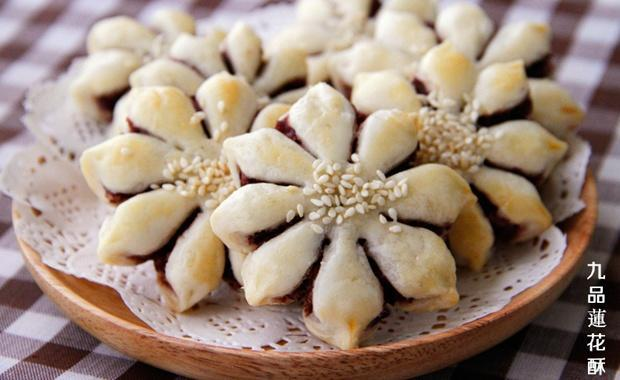

# 预热中秋之超详细版九品莲花酥

## 📋 基本資訊 / Recipe Overview
- **料理名稱**：预热中秋之超详细版九品莲花酥
- **原始標題**：预热中秋之超详细版九品莲花酥
- **素食流派 / Diet**：全素 Vegan
- **料理分類 / Category**：面食主食
- **來源平台 / Source**：[下廚房 · 素食主義專區](https://www.xiachufang.com/recipe/100362395/)

## 🌿 食材及佐料清單 / Ingredients
- 自制红豆沙
- #油皮儿
- 220克小麦粉
- 130克80°热水
- 60克植物油
- #油酥
- 150克小麦粉
- 75克植物油
- #馅料

## 🍳 烹飪步驟 / Step-by-Step Cooking Steps
1. 【油皮儿制作】将油皮儿的所有原料混合。
2. 【油皮儿制作】用筷子搅拌，和成油皮儿。
3. 【油皮儿制作】盖上保鲜膜，饧30分钟。
4. 【油酥制作】将油酥原料混合，和成油酥。
5. 【油酥制作】和好后盖保鲜膜饧30分钟
6. 将饧好的油皮儿揉光滑
7. 将油皮儿14克一份，分成28份。
将油酥8克一份，分成28份。
8. 取一份油皮儿，像擀饺子皮儿一样擀成圆片儿。包住一份油酥。
9. 像包包子一样包住
10. 有点丑，不过只要包好不漏就行
11. 包好后翻面按扁
12. 擀成长条
13. 从一侧向上卷起
14. 卷成柱状
15. 拿起来
16. 按住两头，捏扁
17. 按完整理好，又是一个小圆片
18. 再次擀成圆片
19. 包入豆沙馅儿。
20. 像包包子一样包好。
21. 包好的样子
22. 倒扣后整理一下，基础酥皮儿就包好了
23. 角度40度一个剪九个口。
24. 每一个瓣两头向中间捏紧，九个同样如此。九品莲花酥就捏好了。
25. 排好所有莲花酥，抹上蛋液，撒上芝麻。预热烤箱200度中层烤20分钟。

## 💡 大廚美味秘訣 / Chef's Tips
- 1、油皮儿尽量和的软和一些，隔天吃就不会很干。
2、豆沙馅儿是自制的。方法：将泡好的红豆加水放入高压锅，上汽后煮20分钟，根据情况，如果还有水就再煮一会儿。将煮好的红豆放入料理机打成泥。然后放入炒锅中，一边不停搅拌一边放入红糖和少许植物油，直到炒到粘稠。可以一边尝一边加糖。凉凉就可用了。

---
*食譜歸檔時間：2026-08-20 · 來源：下廚房 (www.xiachufang.com)*