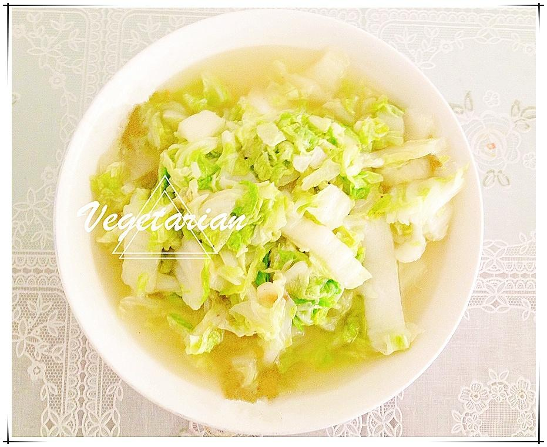

# 食物本身的味道—清炒白菜

## 📋 基本資訊 / Recipe Overview
- **料理名稱**：食物本身的味道—清炒白菜
- **原始標題**：食物本身的味道—清炒白菜
- **素食流派 / Diet**：全素 Vegan
- **料理分類 / Category**：家常蔬食 / 经典热菜
- **來源平台 / Source**：[下廚房 · 素食主義專區](https://www.xiachufang.com/recipe/100101209/)

## 🌿 食材及佐料清單 / Ingredients
- 白菜
- 油
- 盐

## 🍳 烹飪步驟 / Step-by-Step Cooking Steps
1. 锅中少许油，油热后，放入，切好的白菜，白菜炒熟后，撒点盐即可。

## 💡 大廚美味秘訣 / Chef's Tips
- Enjoy your life.

---
*食譜歸檔時間：2026-08-20 · 來源：下廚房 (www.xiachufang.com)*