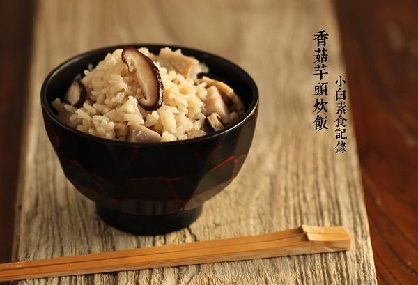

# 香菇芋头炊饭

## 📋 基本資訊 / Recipe Overview
- **料理名稱**：香菇芋头炊饭
- **原始標題**：香菇芋头炊饭
- **素食流派 / Diet**：全素 Vegan
- **料理分類 / Category**：米食主食
- **來源平台 / Source**：[下廚房 · 素食主義專區](https://www.xiachufang.com/recipe/1072043/)

## 🌿 食材及佐料清單 / Ingredients
- 1杯米饭
- 200g芋头
- 3朵香菇
- 1/2小匙盐
- 1大匙生抽

## 🍳 烹飪步驟 / Step-by-Step Cooking Steps
1. 荔浦芋头一块，去皮切丁。香菇三朵洗净去蒂切片。米用水浸泡半小时，控掉水待用
2. 锅烧热下少许油，下香菇和芋头炒香，下入米一同炒匀（炒均匀即可），加盐生抽拌匀即可（无需把芋头炒熟，请不要忽略炒米的步骤，炒米可增加香气）把炒好的料放入电饭锅中，加米量的1.3倍水，按上米饭档即可

## 💡 大廚美味秘訣 / Chef's Tips
- 这碗饭太香了！ 
菜还没烧好我就盛了一碗，加了一点酱油就这样吃~

---
*食譜歸檔時間：2026-08-20 · 來源：下廚房 (www.xiachufang.com)*