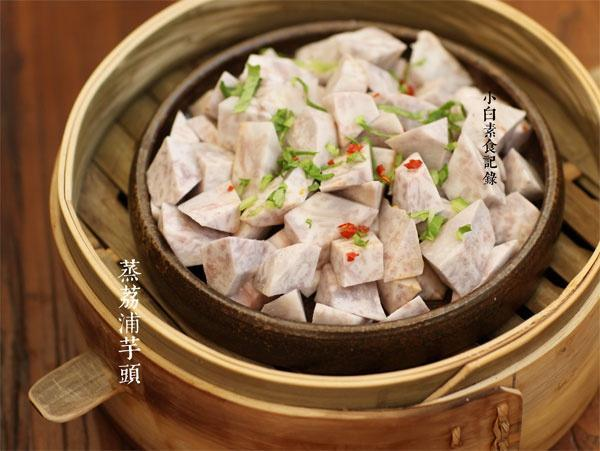

# 香蒸荔浦芋头

## 📋 基本資訊 / Recipe Overview
- **料理名稱**：香蒸荔浦芋头
- **原始標題**：香蒸荔浦芋头
- **素食流派 / Diet**：全素 Vegan
- **料理分類 / Category**：家常蔬食 / 经典热菜
- **來源平台 / Source**：[下廚房 · 素食主義專區](https://www.xiachufang.com/recipe/1069039/)

## 🌿 食材及佐料清單 / Ingredients
- 一块荔浦芋头
- 1/2小匙盐
- 2小匙生抽
- 1大匙水
- 2小匙油

## 🍳 烹飪步驟 / Step-by-Step Cooking Steps
1. 荔浦芋头是这种很大的芋头哦，不是小芋头，通常菜场会像卖冬瓜一样切开来卖
2. 芋头去皮，切成较小的滚刀块（这样可减少蒸的时间，也更加入味）将油、水、盐和生抽混合与芋头块拌匀，装入盘中
3. 蒸锅中的水烧开后，将芋头连盘放入，大火蒸25分钟即可。出锅点缀青菜碎装饰

## 💡 大廚美味秘訣 / Chef's Tips
- 出差20天，终于回京 
吃了20天油腻的饭馆，回到家自己煮了混汤素面捧起碗满满幸福 
秋天芋头季，发过栗子烧芋艿，不同的芋头适合不同的烹饪方法 
荔浦芋头不太适合炖容易碎掉，（除非先微炸后再烹饪）却非常适合这样做，切块摆盘，调个极简单的汁淋上，大火蒸个二十几分钟，香~ 
每次吃的时候都是一个人干掉一大盘~荔浦芋头你怎么那么香啊~ 
最近喜欢各种蒸菜

---
*食譜歸檔時間：2026-08-20 · 來源：下廚房 (www.xiachufang.com)*