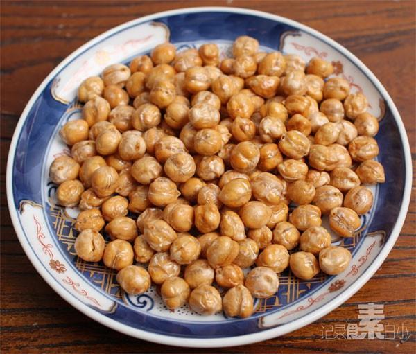

# 香酥鹰嘴豆

## 📋 基本資訊 / Recipe Overview
- **料理名稱**：香酥鹰嘴豆
- **原始標題**：香酥鹰嘴豆
- **素食流派 / Diet**：全素 Vegan
- **料理分類 / Category**：面点小吃
- **來源平台 / Source**：[下廚房 · 素食主義專區](https://www.xiachufang.com/recipe/1008581/)

## 🌿 食材及佐料清單 / Ingredients
- 鹰嘴豆
- 盐

## 🍳 烹飪步驟 / Step-by-Step Cooking Steps
1. 鹰嘴豆用温水泡3个小时以上，泡发泡透，滤干水分，放入冰箱冷冻半小时，取出解冻，滤干水分，再冻半个小时，取出解冻待用
2. 鹰嘴豆与少许盐拌匀，放预热的烤箱中160度20分钟左右即可
3. 鹰嘴豆通过冷冻达到脱水的目的，低温脱水不会损失营养，反而会改变其结果，达到口感香酥的效果 
没经过冷冻脱水的鹰嘴豆口感就要差很多，会发硬 
其他各种豆类都可以用低温冷冻脱水法处理后，再炸，干炒，或者烤制 
 
口感特别的香酥~

## 💡 大廚美味秘訣 / Chef's Tips
- 三高人群，尤其是糖尿病患者，老是觉得饿，管不住嘴巴，但是能吃的东西又有限，鹰嘴豆是一个非常好的选择 
出来煮粥，做菜以外，做成这种方便携带的小零食是非常不错的选择 
 
 
 营养成分 
 鹰嘴豆属于高营养豆类植物，富含多种植物蛋白和多种氨基酸、维生素、粗纤维及钙、镁、铁等成份。 
 主要作用 
 由于鹰嘴豆含有高蛋白、高不饱和脂肪酸、高纤维素、高钙、高锌、高钾、高维生素B等有益人体健康营养素。且其作为食品可直接食用， 
 我国传统医学表明它在治疗糖尿病、心血管病、补血、补钙等方面作用明显。国外对它的药用功能研究成果也颇为丰富。 
 鹰嘴豆的医用效果 
 鹰嘴豆异黄酮是具有活性的植物性类雌激素，它能够延迟女性细胞衰老，使皮肤保持弹性、养颜、丰乳、降血脂、减轻女性更年期综合症，防癌等作用 
 鹰嘴豆含有微量元素铬，铬在机体的糖代谢和脂肪代谢中发挥着重要作用。糖尿病患者正是因为胰岛素相对或绝对不足引起糖代谢，脂肪代谢，蛋白质代谢紊乱。鹰嘴豆对糖尿病具有控制、降低血糖，预防和减缓糖尿病并发症的作用很多血糖高居不下，波动较大，不稳定的糖尿病患者，在食用了鹰嘴豆产品3个月之内血糖都得到了有效的控制，其并发症也得到了有效的预防和减缓。

---
*食譜歸檔時間：2026-08-20 · 來源：下廚房 (www.xiachufang.com)*