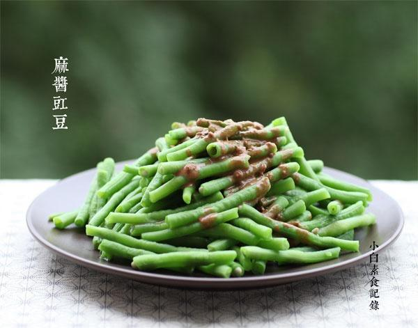

# 麻酱豇豆

## 📋 基本資訊 / Recipe Overview
- **料理名稱**：麻酱豇豆
- **原始標題**：麻酱豇豆
- **素食流派 / Diet**：全素 Vegan
- **料理分類 / Category**：家常蔬食 / 经典热菜
- **來源平台 / Source**：[下廚房 · 素食主義專區](https://www.xiachufang.com/recipe/1048577/)

## 🌿 食材及佐料清單 / Ingredients
- 一把豇豆
- 2小匙芝麻酱
- 1大匙生抽
- 2小匙醋
- 1/2小匙糖
- 1小匙腐乳汁
- 1大匙水

## 🍳 烹飪步驟 / Step-by-Step Cooking Steps
1. 这是豇豆
2. 豇豆洗净，去掉两端，掰成长段
3. 锅中烧开水，下少许盐，下豇豆焯3分钟，捞出过冷水（掐表计时3分钟豇豆已经完全熟了，有朋友留言说要6分钟，然后另一些厨友反馈6分钟太过头了，大家灵活把握，菜有老🈶️嫩，有粗有细，您家的火有大有小，请同时结合目测：是否熟透的方法就是，看是否都变绿了，如果绿里还有点白就是没熟透，再不行咬一下尝尝，没熟就继续啊）ps：有厨友反馈这样做没煮熟中毒了，首先深表歉意，无论是吃什么吃坏了，都会很难受的，没人希望别人难受。但是如果按照本步骤中的时间+后面括弧中的目测方法，不可能不熟呀，豇豆是非常容易熟的蔬菜，因为它很细，食品安全问题写菜谱的人不会开玩笑的，请注意是水开后，如果您冷水下锅那肯定是熟不了啊，吃的时候感觉吃起来有点生那请停止食用啊。如果心里担忧请把豇豆主到咸菜绿，祝大家平安健康！
4. 将芝麻酱、生抽、醋、糖、腐乳汁和水一起搅拌均匀（这里说的芝麻酱是稀释前的，纯芝麻酱，腐乳汁是红豆腐乳里面的汁，可以增加风味）
5. 将酱汁浇在沥干水的豇豆上即可

## 💡 大廚美味秘訣 / Chef's Tips
- 这是款清淡的汁，无麻无辣O(∩_∩)O~

---
*食譜歸檔時間：2026-08-20 · 來源：下廚房 (www.xiachufang.com)*